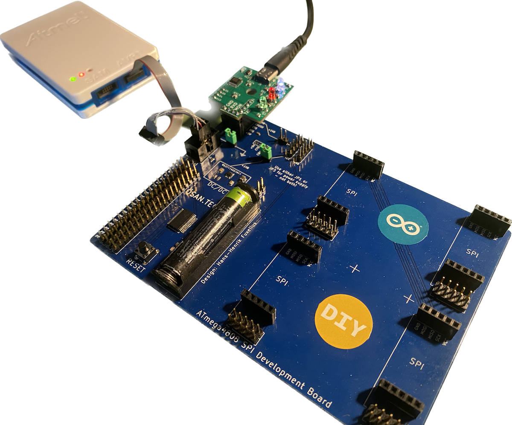
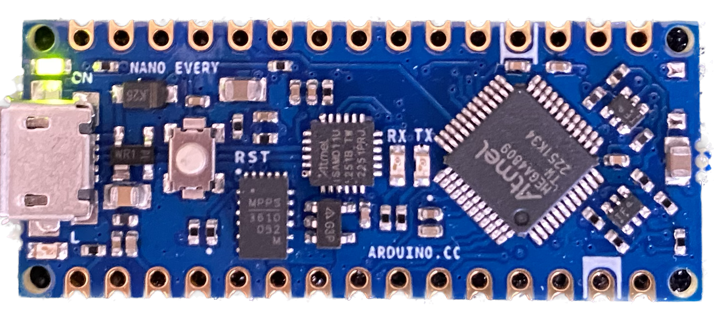

# Library: Interrupt driven and buffered UART for Microchip AVR devices. [Version: RC1]
**``By Hans-Henrik Fuxelius, 2023-05-29``

This UART library is loosely based on a *Technical Brief* [[TB3216](https://ww1.microchip.com/downloads/en/Appnotes/TB3216-Getting-Started-with-USART-DS90003216.pdf)] from **Microchip** 
that I have tried to adhere to in function and naming conventions. The library currently supports up to 8 cuncurrent UARTs and they can be enabled in any order and number as long as it is supported by the microcontroller. Each UART has shared functions and its own circular buffer, so they work fully independent of each other.

The library supports sending plain character and strings to USART as well as formatted strings to a `FILE` stream with standard [avr-gcc \<stdio.h\>](https://www.nongnu.org/avr-libc/user-manual/group__avr__stdio.html#gaa1226b8f734a1b5148d931ae2908c45d) commands such as `fprintf()` and `fprintf_P()`. 

**Note 1**: In the text I have referred to [UART](https://en.wikipedia.org/wiki/Universal_asynchronous_receiver-transmitter) for the library implementation and [USART](https://en.wikipedia.org/wiki/Universal_synchronous_and_asynchronous_receiver-transmitter) for the actual device of the microcontroller which is capable of both.

**Note 2**: The compilation step (separate compilation and linking) here is done on a UNIX machine (**Mac Silicon**) but is equally easy to compile in **Microchip Studio** as well. How to compile on Mac Silicon is described in this [tutorial](https://github.com/fuxelius/atmega4808_bare_metal)

**Note 3**: When refering to *Datasheet* in code or text it this [ATmega4808/ATmega4809](https://ww1.microchip.com/downloads/en/DeviceDoc/ATmega4808-4809-Data-Sheet-DS40002173A.pdf)

## Intended Microchip AVR devices

**megaAVR 0-series**: ATmega808, ATmega809, ATmega1608, ATmega1609, ATmega3208, ATmega3209, ATmega4808 and ATmega4809.

**tinyAVR 0-series**: ATtiny202, ATtiny402, ATtiny204, ATtiny404, ATtiny804, ATtiny1604, ATtiny406, ATtiny806, ATtiny1606, ATtiny807 and ATtiny1607

**tinyAVR 1-series**: ATtiny212, ATtiny412, ATtiny214, ATtiny414, ATtiny814, ATtiny1614, ATtiny416, ATtiny816, ATtiny1616, ATtiny3216, ATtiny417, ATtiny817, ATtiny1617 and ATtiny3217 

**AVR DA devices**: AVR32DA28, AVR64DA28, AVR128DA28, AVR32DA32, AVR64DA32, AVR128DA32, AVR32DA48, AVR64DA48, AVR128DA48, AVR64DA64 and AVR128DA64

**AVR DD devices**: AVR16DD14, AVR32DD14, AVR64DD14, AVR16DD20, AVR32DD20, AVR64DD20, AVR16DD28, AVR32DD28, AVR64DD28, AVR16DD32, AVR32DD32 and AVR64DD32

**AVR DB devices**: AVR32DB28, AVR64DB28, AVR128DB28, AVR32DB32, AVR64DB32, AVR128DB32, AVR32DB48, AVR64DB48, AVR128DB48, AVR64DB64 and AVR128DB64

**AVR EA devices**: AVR16EA28, AVR32EA28, AVR64EA28, AVR16EA32, AVR32EA32, AVR64EA32, AVR16EA48, AVR32EA48 and AVR64EA48

## Devices used in development

This library was initially developed for an [inhouse ATmega4808](https://github.com/fuxelius/atmega4808_bare_metal) project. If you use the ATmega4808 and USART0 it will compile out of the box, otherwise some settings must be done before it works. The setup process of the library is direct and will be described below.

> A development board designed for low power battery operation

**P.S.** As a convenience for rapid test and evaluation, I have also [applied the uart library ](https://github.com/fuxelius/atmega_avr_uart_v2_nano_every) to the [Arduino Nano Every](https://docs.arduino.cc/hardware/nano-every) with an ATmega4809 microcontroller. The setup for how to compile is detailed in [C Programming for 'Arduino Nano Every' Board (ATmega4809) with a Mac and VS Code](https://github.com/fuxelius/nano_every_bare_metal#c-programming-for-arduino-nano-every-board-atmega4809-with-a-mac-and-vs-code)

> The standard Arduino Nano Every development board

## Library Settings
All library setting are done in `uart.h` 

### RBUFFER_SIZE
	// DEFINE RING BUFFER SIZE; must be in {2, 4, 8, 16, 32, 64, 128}  
	#define RBUFFER_SIZE 32
	
> The default value is 32
	
`RBUFFER_SIZE` defines the size of the ringbuffers for Rx and Tx and even out the data flow through these units over time. It also mediates the interrupt driven design. The buffer size is symmetric and equal for both transmit (Tx) and receive (Rx). It has a typical size of 32 or 64, but can be set to any size in its range from {2, 4, 8, 16, 32, 64, 128}. 

### Enabling USARTn

	// ENABLE USART UNITS
	#define USART0_ENABLE
	// #define USART1_ENABLE
	// #define USART2_ENABLE
	// #define USART3_ENABLE
	// #define USART4_ENABLE
	// #define USART5_ENABLE
	// #define USART6_ENABLE
	// #define USART7_ENABLE
	
> Enable USARTn by uncommenting it, here USART0 is enabled

Depending on microcontroller, the library supports up to 8 concurrent USART units. As previously mentioned, they can be enabled in any order and number as long as it is supported by the microcontroller. Each USART has its own independent circular Rx and Tx buffer.	
### Enabling USART Streams

Enable `#define USART_STREAM` if you need to use the [avr-gcc \<stdio.h\>](https://www.nongnu.org/avr-libc/user-manual/group__avr__stdio.html#gaa1226b8f734a1b5148d931ae2908c45d) functions associated with formatting strings and print to streams. Note that streams and functions from **stdio.h** add substantially to the memory footprint. So if you want to have a lean library, *disable* USART streams and stay with the standard functions described below!

## UART Library Standard Functions

The functions below is comprehensive has low memory footprint.

	void usart_set(volatile usart_meta_t* meta, 
	               PORT_t*  port, 
	               uint8_t route, 
	               uint8_t tx_pin, 
	               uint8_t rx_pin);
	
	void usart_init(volatile usart_meta_t* meta, 
	                uint16_t baud_rate);
	                
	void usart_send_char(volatile usart_meta_t* meta, 
	                     char c);
	                     
	void usart_send_string(volatile usart_meta_t* meta, 
	                       const char* str);
	                       
	void usart_send_string_P(volatile usart_meta_t* meta, 
	                         const char* chr);
	
	uuint8_t usart_rx_count(volatile usart_meta_t* meta);
	
	uint16_t usart_read_char(volatile usart_meta_t* meta);
	
	void usart_close(volatile usart_meta_t* meta);

> The common  functions for USART 0 to 7

### USART Settings

	void usart_set(volatile usart_meta_t* meta, 
	               PORT_t*  port, 
	               uint8_t route, 
	               uint8_t tx_pin, 
	               uint8_t rx_pin)

The setting for the USART is given in the datasheet for each microcontroller.

* **meta**: Pointer to the `usart0` - `usart7` defined in library. 
* **port**: Defines PORT used for Tx and Rx. `PORTA` - `PORTF` [Datasheet ss. 143]
* **route**: Route to Tx and Rx pin is given in the datasheet and can be any of: `PORTMUX_USARTn_DEFAULT_gc`, `PORTMUX_USARTn_ALT1_gc` or `PORTMUX_USARTn_NONE_gc`, *n* is in {0,..,7}; [Datasheet ss. 143 and **iom4808.h**/**iom4809.h**]
* **tx_pin**: Tx, transmit pin `PIN0_bm` - `PIN7_bm` [Datasheet ss. 143]
* **rx_pin**: Rx, receive pin `PIN0_bm` - `PIN7_bm` [Datasheet ss. 143]
	

### USART Initialization

	void usart_init(volatile usart_meta_t* meta, 
	                uint16_t baud_rate)

Each unit must be initialized with its baudrate before it can start operate.

### Send Character

	void usart_send_char(volatile usart_meta_t* meta, 
	                     char c)

Sends a single character to an USART

### Send String

	void usart_send_string(volatile usart_meta_t* meta, 
	                       const char* str)

Sends a complete string to USART that end with EOS `'\0'`

### Send String From Flash

	void usart_send_string_P(volatile usart_meta_t* meta, 
	const char* chr)

Sends a complete string to USART that end with EOS `'\0'` from flash memory

* Use `#include <avr/pgmspace.h>` [library](https://www.nongnu.org/avr-libc/user-manual/group__avr__pgmspace.html) in the file header to add a string  that resides in flash memory like `PSTR("Hello World!")`

### Check Receive Buffer Count

	uint8_t usart_rx_count(volatile usart_meta_t* meta)
	
Returns the number of bytes of read character residing in Rx buffer.

### Read Character

	uint16_t usart_read_char(volatile usart_meta_t* meta)

Polling with `read_char()` is used for reading input from a USART receive ringbuffer.

### Close USART

	void usart_close(volatile usart_meta_t* meta)

To be able to close a unit in a mannered way is essential for proper operation, especially if you implement a protocol on top of it. This makes it possible to initialize and close units as they are needed.

## How to use the library
Here is a short overview of how to use the library. The **order of calling** `usart_init()`, `sei()` and `usart_close()`, `cli()` is crucial for correct operation. A **correct session** looks like below!

The file stream `FILE usartN_stream` is used for printing formatted strings with `fprintf` and `fprintf_P` to each USART in use

    // (0) - USART settings; 
    usart_set(&usart0, 
              &PORTA, 
              PORTMUX_USART0_DEFAULT_gc, 
              PIN0_bm, 
              PIN1_bm);

    while (1) {

        // (1) - Init USART
        usart_init(&usart0, (uint16_t)BAUD_RATE(9600));

        // (2) - Enable global interrupts
        sei(); 

        // (3) - Send string to USART
        usart_send_string(&usart0, "\r\n\r\nLove & Peace!\r\n\r\n");

        // (4) - Use sprintf_P, fputs to write to stream
        sprintf_P(buffer, PSTR("Hello world!\r\n"));
        fputs(buffer, &usart0_stream);

        for(size_t i=0; i<5; i++) {
            // (5) - Use formatted fprintf_P to write to stream
            fprintf_P(&usart0_stream, 
                      PSTR("\r\nCounter value: 0x%02X, "), 
                      j++);
            _delay_ms(500);

            // (6) - Get Rx count with usart_rx_count()
            sprintf_P(buffer, 
            			  PSTR("rx count: %i "), 
            			  usart_rx_count(&usart0));
            fputs(buffer, &usart0_stream);            

            // (7) - Get USART input by polling ringbuffer
            while(!((c = usart_read_char(&usart0)) & USART_NO_DATA)) {

                if (c & USART_PARITY_ERROR) {
                    usart_send_string_P(&usart0, 
                              PSTR("USART PARITY ERROR:\r\n"));
                }
                if (c & USART_FRAME_ERROR) {
                    usart_send_string_P(&usart0, 
                              PSTR("USART FRAME ERROR:\r\n"));
                }
                if (c & USART_BUFFER_OVERFLOW) {
                    usart_send_string_P(&usart0, 
                              PSTR("USART BUFFER OVERFLOW ERROR:\r\n"));
                }

                // (8) - Send single character to USART
                usart_send_char(&usart0, (char)c);
            }
        }

        // (9) - Check that everything is printed before closing USART
        fprintf_P(&usart0_stream, PSTR("\r\n\r\n<-<->->"));

        // (10) - Close USART0
        usart_close(&usart0);    

        // (11) - Clear global interrupts
        cli();
	}

### (0) - UART Settings
Set the PORT, PORTMUX route and selected TX PIN and RX PIN.

The Port Multiplexer (PORTMUX) can either enable or disable the functionality of the pins, or change between default and alternative pin positions. Available options are described in detail in the PORTMUX register map and depend on the actual pin and its properties. Select which ever is appropriate for your selection of USARTn and pin selection. [ATmega 4809 Datasheet ss. 139]

	usart_set(&usart0,                    // A) USART
	          &PORTA,                     // B) PORT
	          PORTMUX_USART0_DEFAULT_gc,  // C) Config
	          PIN0_bm,                    // D) Tx
	          PIN1_bm);                   // E) Rx
	          		

> Above the default pins are used on USART0, no need to change PORTMUX. Enable PA01 for receive and PA00 for transmit.

	usart_set(&usart3,                    // A) USART
	          & PORTB,                    // B) PORT
	          PORTMUX_USART3_ALT1_gc,     // C) Config
	          PIN4_bm,                    // D) Tx
	          PIN5_bm);                   // E) Rx

> Above example is port multiplexing for pin PB04 and PB05 for USART3 as given in the USART library given for Arduino Nano Every. [ATmega 4809 Datasheet ss. 143]

### (1) - Init UART
The library must be initialized **before** enabling global interrupts in step 2.

### (2) - Enable global interrupts
Once global interrupts are enabled the library starts to work, **not** before!

### (3) - Send string to UART
`usart_send_string(usart, str, len)` is the plain function for printing to USART, it has no formatting but also has a smaller library footprint than using `fprintf()`

### (4) - Use sprintf_P to format a string
The created filestream `&usart0_stream` lets you write directly with `fprintf(FILE *stream, const char          *format)`

### (5) - Use formatted fprintf_P to write to UART
An example of *formatted printing* with `fprintf()`

### (6) - Get Rx count
Returns the number of bytes of read character residing in Rx buffer.

### (7) - Get UART input by polling ringbuffer
All USART input and output is mediated by ringbuffers, and input from the units is done by active **polling** of the input buffer with `usart_read_char(usartN)`. What you type on keyboard are printed to USARTn!

### (8) - Send single character to UART
`usart_send_char(usartN)` is the plain function for sending a single character to USART.

### (9) - Check that everything is printed before closing UART
This string is just a test to see that it is completely and correctly written to USART before unit is closed.

### (10) - Close UARTn
Is is important to properly being able to open and close USART devices without loosing any information. Here it loops over and over again for testing!

### (11) - Clear global interrupts
`cli()` **must** be called after `usart_close()`